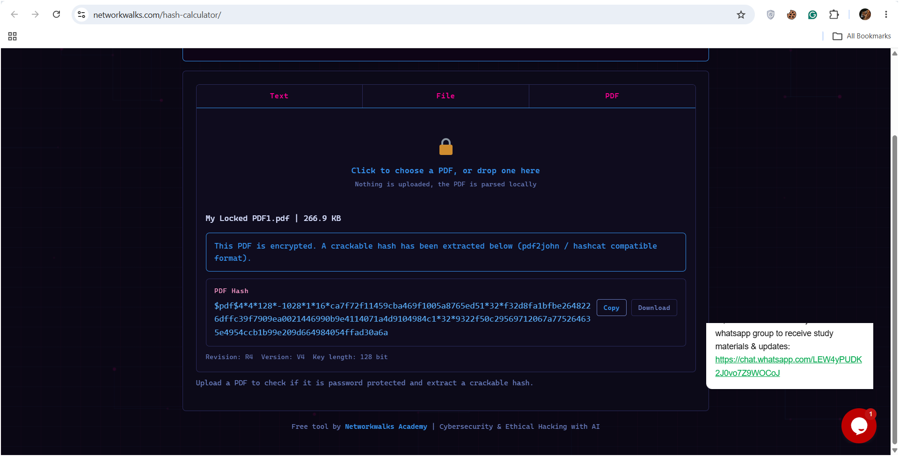
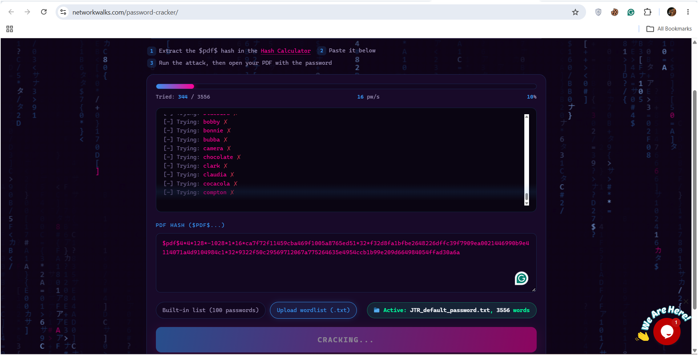
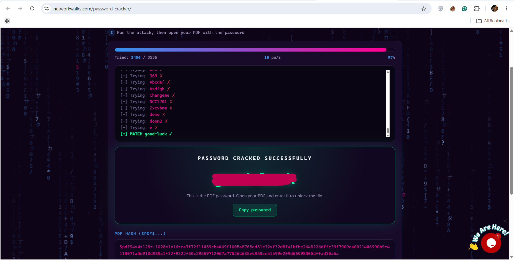
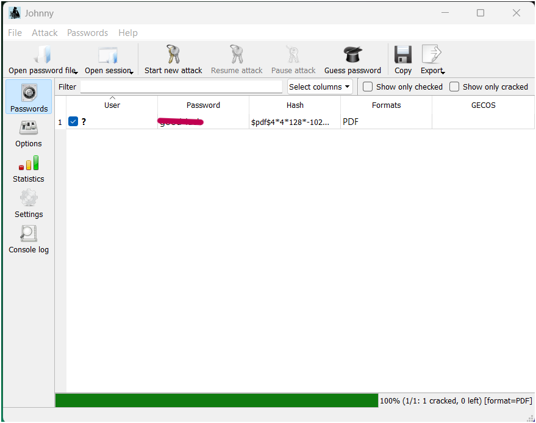
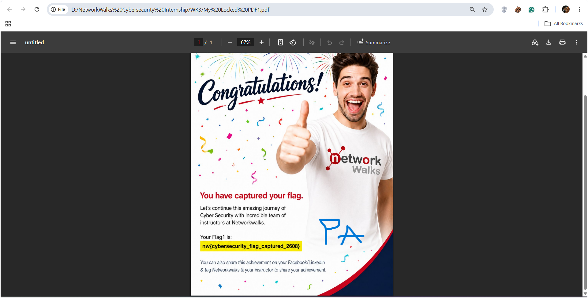
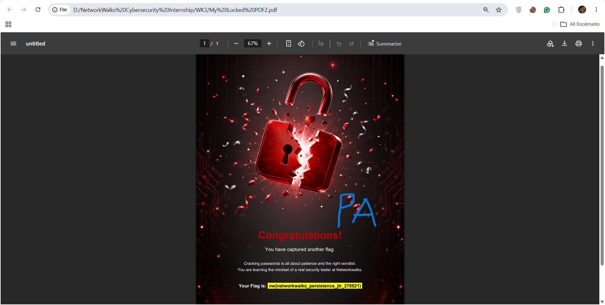

# Week 3 — Password Cracking Lab

## NetworkWalks Cybersecurity Internship

This repository documents my Week 3 practical project from the **NetworkWalks Cybersecurity Internship**.

The week focused on password-cracking concepts and practical recovery of passwords from protected PDF files in a controlled cybersecurity/CTF-style lab environment.

### Required Week 3 Modules

- **W3-PM1: Password Cracking with JTR**
- **W3-PM2: Password Cracking with NetworkWalks Tools**

---

## Project Overview

The practical work involved **three password-protected PDF files**.

I used two different approaches:

### 1. John the Ripper

I used **John the Ripper (JTR)** through:

- The command-line interface (CLI)
- **Johnny**, the graphical interface for John the Ripper

Using JTR, I successfully recovered the passwords for **two of the three protected PDF files**.

### 2. NetworkWalks Academy Tools

I also used the NetworkWalks Academy:

- **Hash Calculator**
- **Password Cracker**

With this workflow, I extracted a crackable PDF hash and submitted it to the Password Cracker, which successfully recovered the password for **one of the three PDF files**.

---

## Lab Workflow

```text
Password-protected PDF
        │
        ▼
Extract PDF hash
        │
        ├───────────────┐
        ▼               ▼
John the Ripper     NetworkWalks
CLI / Johnny        Hash Calculator
        │               │
        ▼               ▼
Dictionary attack   Extract $pdf$ hash
        │               │
        │               ▼
        │          NetworkWalks
        │          Password Cracker
        │               │
        └───────┬───────┘
                ▼
        Recovered password
                │
                ▼
        Open/validate PDF
```

---

## Results

| PDF | Method | Result |
|---|---|---|
| Locked PDF 1 | NetworkWalks Hash Calculator + Password Cracker | ✅ Password recovered |
| Locked PDF 2 | John the Ripper / Johnny GUI | ✅ Password recovered |
| Locked PDF 3 | John the Ripper CLI / Johnny GUI | ✅ Password recovered |

### Final Result

**3/3 protected PDFs successfully recovered.**

- **1/3** recovered using the NetworkWalks Academy Hash Calculator + Password Cracker.
- **2/3** recovered using John the Ripper.

The recovered passwords were verified by opening the corresponding protected PDF files.

---

## Tools Used

| Tool | Purpose |
|---|---|
| John the Ripper | Password recovery/cracking |
| Johnny GUI | Graphical interface for JTR |
| NetworkWalks Hash Calculator | Extracting crackable hashes from protected PDFs |
| NetworkWalks Password Cracker | Dictionary-based password recovery |
| Windows CLI | Running JTR commands |
| PDF reader | Validating recovered passwords |

---

## Key Learning Outcomes

### PDF Hash Extraction

I learned how a password-protected PDF can be converted into a crackable hash representation. The NetworkWalks Hash Calculator produces a PDF hash beginning with `$pdf$`, which can then be supplied to a compatible password-cracking tool.

### Dictionary-Based Attacks

The lab demonstrated how a password cracker can test candidate passwords from a wordlist until a matching password is found.

### CLI vs GUI

Working with both JTR CLI and Johnny GUI gave me practical experience with two different ways of interacting with the same underlying password-cracking tool.

The CLI provided a direct command-driven workflow, while Johnny provided a graphical interface for loading password files and starting attacks.

### Password Security

The exercise reinforced an important security principle:

> Password strength matters.

Common or predictable passwords are more vulnerable to dictionary-based attacks, while longer and more complex passwords can increase the effort required for recovery.

---

## Evidence

Screenshots from the practical exercise document:

- NetworkWalks Hash Calculator extracting a PDF hash



- NetworkWalks Password Cracker performing a dictionary attack



- A successful password match in the Password Cracker



- John the Ripper/Johnny showing a successfully cracked PDF password



- The recovered PDFs opening successfully after entering the recovered passwords






---

## Ethical & Legal Scope

This work was performed as part of a **controlled cybersecurity internship laboratory/CTF-style exercise** using the files provided for the training task.

Password-cracking techniques should only be used against systems, files, accounts, or data for which you have explicit authorization.

The purpose of this exercise was to understand:

- Password security
- Hash extraction
- Dictionary attacks
- Password recovery workflows
- Ethical hacking methodology
- Defensive security awareness

---

## Week 3 Modules

The required Week 3 modules were:

- **W3-PM1 — Password Cracking with JTR**
- **W3-PM2 — Password Cracking with NetworkWalks Tools**

---

## Conclusion

Week 3 provided practical exposure to password-cracking workflows using both traditional command-line tooling and web-based cybersecurity tools.

The project strengthened my understanding of how protected PDF files can be analyzed, how crackable hashes are extracted, how dictionary-based attacks work, and how recovered passwords can be validated in a controlled environment.

**Result: 3/3 protected PDFs successfully recovered.**

#Cybersecurity #EthicalHacking #JohnTheRipper #PasswordCracking #CTF #NetworkWalks #CybersecurityInternship
